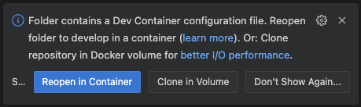
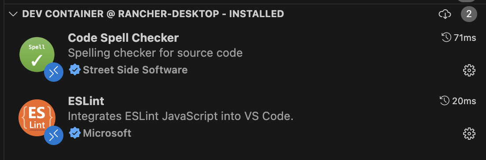

To get started quickly:

1. Install Visual Studio Code
2. Install Docker or other compatible software (e.g. Rancher)
3. Install the Dev Containers extension

For detailed instructions, visit [Dev Containers tutorial](https://code.visualstudio.com/docs/devcontainers/tutorial)

Note that the dev container in this project is based off of the one mentioned in [Create a Dev Container](https://code.visualstudio.com/docs/devcontainers/create-dev-container)

1. Clone this project
2. Open this project in Visual Studio Code
3. You should get the following prompt:

click the `Reopen in Container` button
4. View extensions. If working properly, they following should be installed in the container:

if these extensions do not exist, something is blocking them, presumably Netskope
